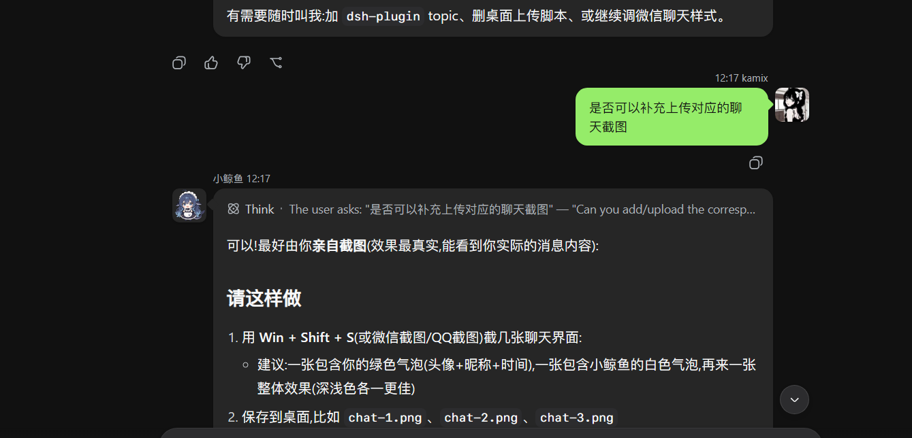

# dsh-wechat-chat

DSH (DeepSeek Harness) Web 微信风格气泡聊天插件。

## 特性

- 微信风格聊天界面:浅灰背景(深色模式自动适配 `body[data-ds-dark-theme]`)
- 你的消息:右侧绿色气泡 + 头像 + 昵称(`kamix`)
- 小鲸鱼的消息:左侧白色气泡 + 头像 + 昵称(`小鲸鱼`)
- 思考中状态文案:"Deep diving..." → "小鲸鱼正在thinking中"
- 头像/昵称/时间戳全部通过 CSS 伪元素 + CSS 变量实现,React 重渲染不会破坏
- 气泡宽度、圆角、尾巴、深色配色均可通过 CSS 自定义

## 截图



## 安装

将插件目录放到 DSH 的 profile 插件目录,并在 profile 的 `package.json` 的
`dsh.profile.bundles` 中加入 `@dsh-external/dsh-wechat-chat`:

```json
{
  "dsh": {
    "profile": {
      "bundles": ["@deepseek-ai/dsh-base", "@deepseek-ai/dsh-web-app", "@dsh-external/dsh-wechat-chat"]
    }
  }
}
```

重启 `npx @deepseek-ai/dsh web` 后生效。

## 自定义

编辑 `lib/client.js` 顶部的常量即可:

- `USER_NAME` / `ASSISTANT_NAME` — 昵称
- `USER_AVATAR` / `ASSISTANT_AVATAR` — 头像(URL 或 data URI)
- CSS 变量 `--wcx-name` / `--wcx-time` 控制每行昵称与时间戳

## License

MIT
